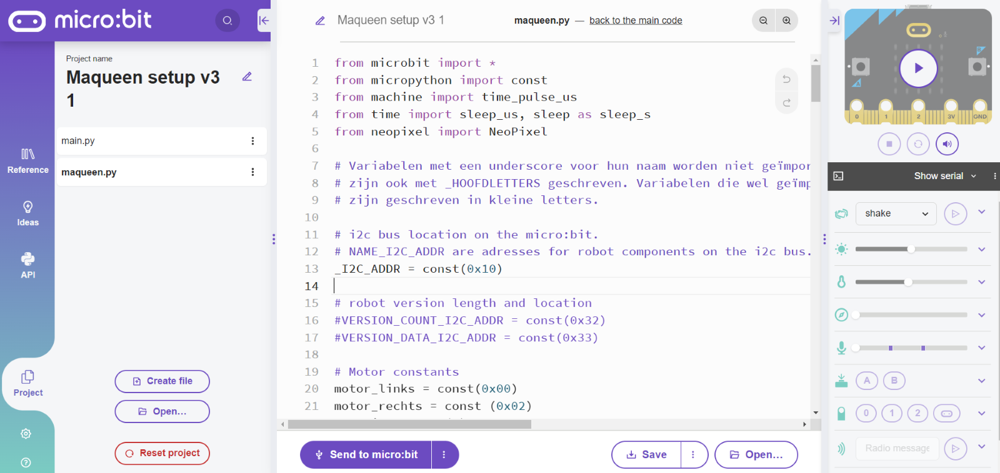
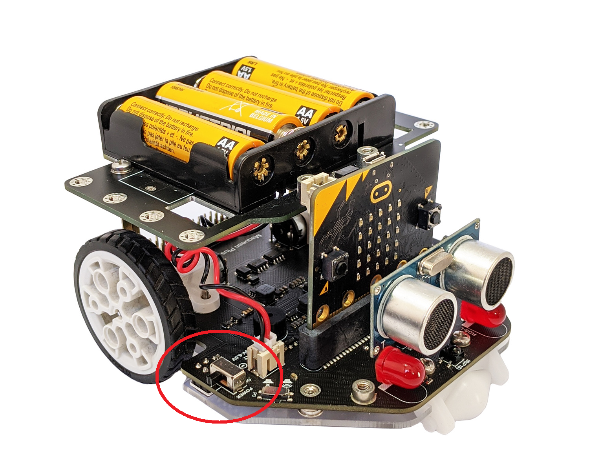

# Hoofdstuk 2: Kennismaken met de robot

Nu we de basis van de taal kennen, gaan we het leukste deel doen: de code tot leven wekken. We gaan de micro:bit koppelen aan de Maqueen robot.

## Het Brein en het Lichaam

Je kunt de **micro:bit** zien als het *hersenen* van de robot. Hij kan denken, rekenen en beslissingen nemen.
De **Maqueen** is het *lichaam*. Hij heeft wielen (spieren), lampjes en sensoren (zintuigen).

Zonder de micro:bit is de Maqueen slechts een levenloos stuk plastic. Zonder de Maqueen kan de micro:bit nergens heen. Samen vormen ze een robot!

### Stap 1: De Gereedschapskist (Import)

De robot heeft specifieke commando's die niet in de standaard Python 'taal' zitten, zoals "start motor". Hiervoor moeten we een extra bibliotheek importeren.
1.  Zorg dat het bestand `maqueen.hex` of `maqueen.py` beschikbaar is in je editor (je docent vertelt hoe).
2.  Begin je code altijd met:

	from maqueen import *
	init_maqueen()

De regel `init_maqueen()` controleert of de verbinding tussen het brein (micro:bit) en het lichaam (robot) goed werkt.

## De Robot Aansluiten (Veiligheid!)

> [!WAARSCHUWING]
> **Belangrijk:** Zet de robot pas AAN als hij op de grond staat of als je hem vasthoudt. 
> Zet de robot UIT voordat je de kabel erin steekt.

1.  Sluit de micro:bit met de USB-kabel aan op de computer.
2.  Klik in de editor op **Send to micro:bit**.
3.  Volg de instructies op het scherm (selecteer de micro:bit en klik Verbinding maken).
4.  Als de code is verstuurd: haal de kabel los, steek de micro:bit in de robot, en zet de schakelaar op de robot op ON.

## Beweging: Actie en Reactie

Laten we de robot laten rijden.

	from maqueen import *
	init_maqueen()
	
	motor_aan(motor_links)
	motor_aan(motor_rechts)
	sleep(1000)
	motor_uit(motor_links)
	motor_uit(motor_rechts)
	
**Wat gebeurt hier?**
1.  We zetten links en rechts aan. De robot rijdt rechtdoor.
2.  `sleep(1000)`: De robot blijft doen wat hij deed... voor 1 seconde! Hij rijdt dus 1 seconde lang door.
3.  We zetten de motoren uit.

### Snelheid aanpassen (Gas geven!)

De motoren kunnen niet alleen AAN of UIT. Je kunt ook bepalen hoe hard ze draaien.
De functie `motor_aan` heeft eigenlijk een tweede optie: de snelheid.
*   **0** = Stilstand
*	**31** = Standaard snelheid (hoef je niet in te typen)
*   **255** = Maximale snelheid

Wil je op halve snelheid rijden?

	motor_aan(motor_links, snelheid=128)
	motor_aan(motor_rechts, snelheid=128)
	
De standaardwaarde voor de snelheid is 31. Dus als je de snelheid niet aanpast, is dit de snelheid die meegegeven wordt met de functie.

### Achteruit rijden

De robot kan ook achteruit! Daarvoor gebruiken we een derde optie in het commando: de richting.
*   **0** = Vooruit (Standaard, hoef je niet in te typen)
*   **1** = Achteruit

	# Volle kracht achteruit!
	motor_aan(motor_links, snelheid=255, richting=1)
	motor_aan(motor_rechts, snelheid=255, richting=1)

### Experimenteer (Investigate)
Wat zou er gebeuren als je:
*   Alleen `motor_links` aanzet?
*   `motor_links` AAN zet, maar `motor_rechts` UIT?
*   De `sleep` weghaalt? (Spoiler: De robot zet de motor aan, en milliseconden later direct weer uit. Je ziet waarschijnlijk niks!)

## Opdrachten hoofdstuk 2

1.  **De Dans**: Laat de robot 1 seconde vooruit rijden, en daarna 1 seconde achteruit (gebruik parameters, zie `reference` of vraag de docent hoe je achteruit rijdt).
2.  **Rondje Draaien**: Schrijf code zodat de robot precies één heel rondje (360 graden) draait op zijn plek. Je zult moeten experimenteren met de timing in `sleep(...)`. Is 1000ms genoeg? Of 2000ms?
3.  **Het Vierkant**: Probeer de robot een vierkant te laten rijden.
    *   Vooruit
    *   Draai 90 graden
    *   Vooruit
    *   Draai 90 graden
    *   ... (herhaal)
4.  **Onderzoek**: Wat is de maximale snelheid van de robot? Kun je in de documentatie (of via `help`) vinden hoe je de snelheid aanpast in de functie `motor_aan`? Probeer hem eens op halve snelheid te laten rijden.