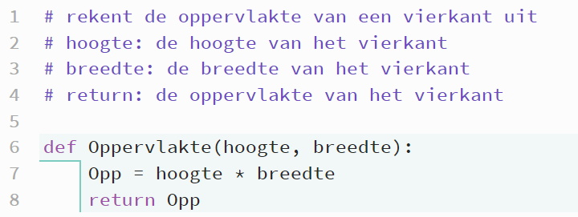
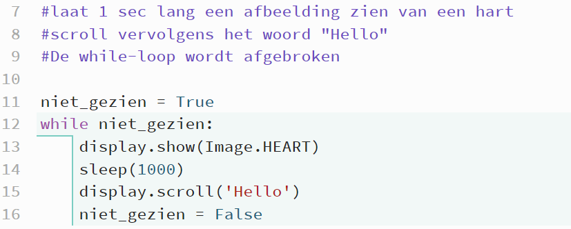

# Hoofdstuk 3: Sensoren en Zintuigen

Jij hebt ogen en oren om de wereld te begrijpen. Een robot heeft **sensoren**. Zonder sensoren is een robot blind en doof en botst hij overal tegenaan. 

De Maqueen heeft twee belangrijke soorten zintuigen:
1.  **Lijnvolgsensoren** (Ogen op de grond): Zien donker vs licht.
2.  **Ultrasoonsensor** (Vleermuis-oren): "Zien" afstand door geluid te weerkaatsen.

## De Lijnvolgsensoren (Infrarood)

Kijk eens onderop de robot. Je ziet daar 5 kleine zwarte blokjes. Dit zijn de infraroodsensoren, die we ook wel de **lijnvolgsensoren** noemen. Iedere sensor bestaat uit twee delen, namelijk de zender en de ontvanger. De zender zendt infrarood licht uit (onzichtbaar voor het menselijk oog). De ontvanger vangt afhankelijk van de ondergrond veel of weinig van het teruggekaatste licht op. Zie ook de afbeelding hieronder.

*   Zendt onzichtbaar licht uit.
*   **Wit papier:** Kaatst veel licht terug.
*   **Zwarte tape:** Absorbeert het licht (slurpt het op).

De computer krijgt een getal terug.
*   **Laag getal (< 100)**: Ik zie ZWART (lijn).
*   **Hoog getal (> 100)**: Ik zie WIT (papier).

*Let op: Dit kan per robot verschillen! Lichtinval in het lokaal heeft invloed.*

## De Ultrasoonsensor (Afstand)

Bovenop de robot zitten twee "ogen". Stiekem zijn dit speakers!
*   Linker oog: "Gilt" een heel hoog toontje (Ultrasoon, wij horen het niet).
*   Rechter oog: Luistert wanneer de echo terugkomt.

`Afstand = Tijd * Snelheid van het geluid / 2`

Gelukkig hoeven wij die wiskunde niet te doen. De functie `afstand_tot_voorwerp()` geeft ons direct het aantal centimeters.

## Opdrachten hoofdstuk 3: Het Laboratorium

We gaan vandaag niet zomaar code overtypen, we gaan **meten**.

1.  **De Kalibratie-test**:
    Schrijf een programma dat continu de waarde van de *middelste* lijnsensor (`lijnsensor_m`) op de micro:bit toont (met `display.scroll`).
    *   Houd de robot boven wit papier. Wat is het getal?
    *   Houd de robot boven zwarte tape. Wat is het getal?
    *   Houd de robot in de lucht. Wat is het getal?
    *   *Conclusie:* Welk getal ligt veilig in het midden om als grens ("drempelwaarde") te gebruiken?

2.  **Kleurenblind?**:
    De sensor werkt met Infrarood, niet met kleur zoals wij dat zien. Test de sensor op een **rood** en een **blauw** vlak. Ziet de robot dit als "wit" (licht weerkaatsend) of "zwart" (absorberend)?
	
3. 	**Van het padje**:
	Zet de robot schuin op een zwarte lijn en onderzoek welke lijnvolgsensoren een hoge en welke een lage waarde meten.

4.  **Vleermuis-modus**:
    Schrijf een programma dat de `afstand_tot_voorwerp()` laat zien.
    *   Zet je hand op 5 cm afstand. Klopt de meting?
    *   Wat is de *maximale* afstand die hij kan zien? (Loop langzaam achteruit met een boek).
    *   Wat gebeurt er als je een zacht kussen gebruikt in plaats van een hard boek? (Denk aan hoe geluid weerkaatst).

5.  **Het Alarm**:
    Verzin een toepassing. Bijvoorbeeld:
    *   Als de robot wordt opgetild (lijnsensor ziet geen vloer meer), moet hij een droevig gezichtje tonen.
    *   Als iemand te dichtbij komt (afstand < 10cm), moet hij een boos gezichtje tonen.