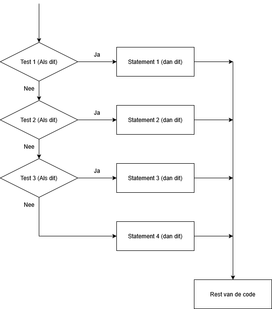

# Hoofdstuk 4: Als dit, dan dat (If-statements)

Het leven van een robot zit vol keuzes. 
*   "Zie ik een muur? Dan moet ik stoppen."
*   "Zie ik een lijn? Dan moet ik volgen."

Om de robot deze keuzes te laten maken, gebruiken we **if-statements** (als-dan regels). Hiermee kan de robot reageren op zijn omgeving.

## Vergelijkingen (Operatoren)

Voordat de robot een keuze maakt, moet hij eerst iets controleren. Bijvoorbeeld: "Is de afstand kleiner dan 15 cm?". In Python gebruiken we daarvoor speciale tekens, de **operatoren**.

| Operator | Betekenis                 | Voorbeeld (in codetaal)          | Betekenis in mensentaal |
|:---------|:--------------------------|:---------------------------------|:------------------------|
| ==       | Gelijk aan                | `afstand_tot_voorwerp() == 10`   | Is de afstand precies 10? |
| !=       | Niet gelijk aan           | `read_line_sensor(l1) != 0`      | Ziet de sensor *niet* zwart? |
| <        | Kleiner dan               | `afstand_tot_voorwerp() < 15`    | Is de muur dichterbij dan 15 cm? |
| >        | Groter dan                | `read_line_sensor(m) > 100`      | Ziet de sensor veel licht (wit)? |

## Het If-statement

Stel, we willen dat de robot stopt als hij bijna tegen een muur botst.
In mensentaal: "Als de afstand kleiner is dan 10 cm, zet dan de motoren uit."

In Python ziet dat er zo uit:

	if afstand_tot_voorwerp() < 10:
		motor_uit(motor_links)
		motor_uit(motor_rechts)
		display.show(Image.ANGRY)

**Hoe werkt het?**
1.  Python kijkt naar de regel `if ... :`.
2.  Is het waar wat daar staat? (Is de afstand < 10?)
3.  **JA:** Dan voert hij de ingesprongen regels uit (motoren uit, boos kijken).
4.  **NEE:** Dan slaat hij de ingesprongen regels over en gaat gewoon verder.

## Else: Wat als het NIET zo is?

Soms wil je dat de robot iets anders doet als de voorwaarde *niet* waar is.
Bijvoorbeeld: "Als je een lijn ziet, rijd dan. Anders (als je geen lijn ziet), stop dan."

	if read_line_sensor(lijnsensor_m) < 100:
		# Situatie A: Hij ziet de lijn (zwart)
		motor_aan(motor_links)
		motor_aan(motor_rechts)
	else:
		# Situatie B: Hij ziet GEEN lijn (wit)
		motor_uit(motor_links)
		motor_uit(motor_rechts)

Het commando `else` betekent dus eigenlijk: "In alle andere gevallen..."

## Elif: Meerdere keuzes (En-als)

Soms zijn er meer dan twee opties. Denk aan een bewaker:
1.  Is de afstand heel klein (< 10)? -> **Paniek!** (Rempedaal)
2.  Is de afstand een beetje klein (< 30)? -> **Rustig aan.** (Rem een beetje af)
3.  Anders? -> **Gas erop!** (Volle kracht)

Dit schrijven we met `elif` (een afkorting van Else If).

	afstand = afstand_tot_voorwerp()

	if afstand < 10:
		motor_uit(motor_links)
		motor_uit(motor_rechts)
		display.show(Image.NO)
	elif afstand < 30:
		motor_aan(motor_links, 50, 0) # Langzaam rijden
		motor_aan(motor_rechts, 50, 0)
		display.show(Image.CONFUSED)
	else:
		motor_aan(motor_links, 255, 0) # Snel rijden
		motor_aan(motor_rechts, 255, 0)
		display.show(Image.HAPPY)

Python controleert deze regels van boven naar beneden. Zodra hij een regel vindt die 'waar' is, voert hij die uit en slaat de rest van het rijtje over.

## Combineren: En / Of

Soms moet aan twee voorwaarden tegelijk voldaan worden.
*   "Ik wil rijden ALS ik de lijn zie **EN** er geen muur voor me staat."

Hiervoor gebruiken we `and` en `or`.

| Operator | Betekenis | Voorbeeld |
|:---|:---|:---|
| `and` | EN | `lijn < 100 and afstand > 10` |
| `or`  | OF | `knop_a.is_pressed() or knop_b.is_pressed()` |

Voorbeeld: Een veilige lijnvolger.

	if read_line_sensor(lijnsensor_m) < 100 and afstand_tot_voorwerp() > 10:
		# Lijn zichtbaar EN de weg is vrij
		motor_aan(motor_links)
		motor_aan(motor_rechts)
	else:
		# Of geen lijn, of een obstakel
		motor_uit(motor_links)
		motor_uit(motor_rechts)

## Opdrachten hoofdstuk 4

1.  **Stop de botsing**: Schrijf een programma waarbij de robot hard vooruit rijdt (snelheid 200). Zodra de afstandssensor minder dan 15 cm meet, moet de robot vol in de remmen (motoren uit) en een doodshoofd (`Image.SKULL`) laten zien.

2.  **Lijnvolger Logic**:
    De robot rijdt over een witte vloer met zwarte tape.
    *   Als de `lijnsensor_m` zwart ziet (< 100): Rijd rechtdoor.
    *   Als de `lijnsensor_l1` (links) zwart ziet: De robot dreigt naar rechts van de weg te raken! Stuur bij naar links (`motor_rechts` aan, `motor_links` uit).
    *   Als de `lijnsensor_r1` (rechts) zwart ziet: Stuur bij naar rechts (`motor_links` aan, `motor_rechts` uit).
    *   *Tip: Gebruik `if`, `elif`, `elif`.*

3.  **De Bangbroek**:
    Maak een robot die bang is voor donker én voor muren.
    *   Als het lichtniveau (< 50) is **OF** de afstand (< 20) is:
    *   Dan moet de robot achteruit rijden en gillen (`audio.play(Sound.SCREAM)`).
    *   Anders: Rijd vrolijk rond.

4.  **Het Slimme Stoplicht**:
    Gebruik de kleurenstickers (of gekleurd papier).
    *   Schrijf code die de kleuren leest (hint: test eerst wat de sensorwaardes zijn voor Rood, Groen en Blauw).
    *   Als Rood: Stop.
    *   Als Groen: Rijd door.
    *   Als Blauw: Draai een rondje.
    *(Let op: De lijnsensor ziet kleuren als grijstinten. Je zult moeten experimenteren met grenswaardes, bijv: Rood is tussen 40-60, Groen tussen 80-100).* 
